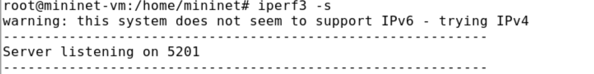
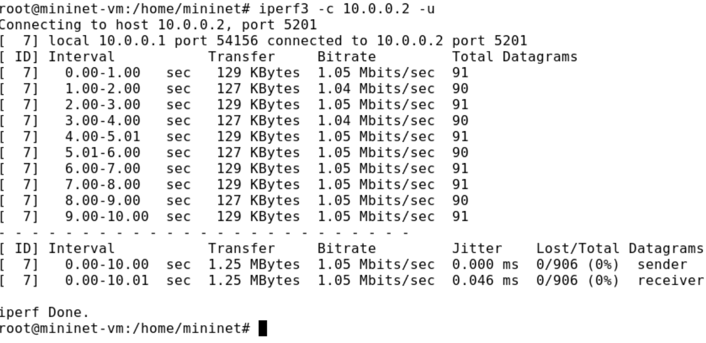
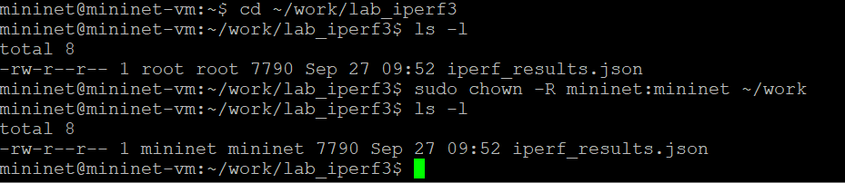

---
## Front matter
lang: ru-RU
title: Лабораторная Работа №2. 
subtitle: Моделирование сетей передачи данных
author:
  - Боровиков Д.А.
institute:
  - Российский университет дружбы народов им. Патриса Лумумбы, Москва, Россия

## i18n babel
babel-lang: russian
babel-otherlangs: english

## Formatting pdf
toc: false
toc-title: Содержание
slide_level: 2
aspectratio: 169
section-titles: true
theme: metropolis
header-includes:
 - \metroset{progressbar=frametitle,sectionpage=progressbar,numbering=fraction}
 - '\makeatletter'
 - '\beamer@ignorenonframefalse'
 - '\makeatother'

## Fonts
mainfont: Arial
romanfont: Arial
sansfont: Arial
monofont: Arial
---

## Докладчик

  * Боровиков Даниил Александрович
  * НПИбд-01-22
  * Российский университет дружбы народов
  * [1132222006@pfur.ru]

## Цели и задачи

Основной целью работы является знакомство с инструментом для измерения
пропускной способности сети в режиме реального времени — iPerf3, а также
получение навыков проведения интерактивного эксперимента по измерению
пропускной способности моделируемой сети в среде Mininet.

## Обновление репозиториев программного обеспечения

{#fig:001 width=70%}

## Установка iperf3

{#fig:002 width=60%}

## Установка программного обеспечения 

{#fig:003 width=70%}

## Развертывание iperf3_plotter

{#fig:004 width=60%}

## Исправление прав запуска X-соединения

{#fig:005 width=70%}

## Создание простейшей топологии

{#fig:006 width=60%}

## Просмотр параметров топологии

{#fig:007 width=70%}

## Запуск сервера iperf3 в терминале h2

{#fig:008 width=60%}

## Запуск клиента iperf3 в терминале хоста h1

{#fig:009 width=70%}

## Остановка сервера iPerf3 в терминале хоста h2

{#fig:010 width=60%}

## Запуск сервера iperf3 

{#fig:011 width=70%}

## Запуск сервера iperf3 в терминале h2

{#fig:012 width=60%}

## Запуск клиента iperf3

{#fig:013 width=70%}

## Запуск сервера iperf3 

{#fig:014 width=60%}

## Запуск клиента iperf3 

{#fig:015 width=70%}

## Запуск сервера iperf3 в терминале h2

{#fig:016 width=60%}

## Запуск клиента iperf3 

{#fig:017 width=70%}

## Запуск сервера iperf3 в терминале h2

{#fig:018 width=60%}

## Запуск клиента iperf3 в терминале h1 с протоколом UDP

{#fig:019 width=70%}

## Запуск сервера iperf3 в терминале h2 с портом прослушивания

{#fig:020 width=60%}

## Запуск клиента iperf3 в терминале h1 с портом 

{#fig:021 width=70%}

## Запуск сервера iperf3

{#fig:022 width=60%}

## Запуск клиента iperf3 в терминале h1

{#fig:023 width=70%}

## Создание каталога для работы над проектом

{#fig:024 width=60%}

## Запуск сервера iperf3 в терминале h2

{#fig:025 width=70%}

## Запуск клиента iperf3 

{#fig:026 width=60%}

## Экспортирование вывода результатов теста в файл

{#fig:027 width=70%}

## Проверка создания файла

{#fig:028 width=60%}

## Завершение работы mininet в интерактивном режиме

{#fig:029 width=70%}

## Корректирование прав доступа к файлу JSON

{#fig:030 width=60%}

## Генерация выходных данных и последующая проверка

{#fig:031 width=70%}

## Вывод

В ходе выполнения лабораторной работы я познакомился с инструментом для измерения
пропускной способности сети в режиме реального времени — iPerf3, а также
получение навыков проведения интерактивного эксперимента по измерению
пропускной способности моделируемой сети в среде Mininet.

