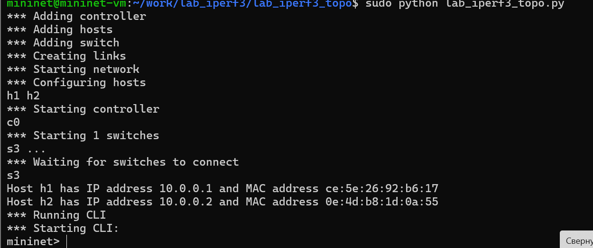

---
## Front matter
lang: ru-RU
title: Лабораторная Работа №3. 
subtitle: Моделирование сетей передачи данных
author:
  - Боровиков Д.А.
institute:
  - Российский университет дружбы народов им. Патриса Лумумбы, Москва, Россия

## i18n babel
babel-lang: russian
babel-otherlangs: english

## Formatting pdf
toc: false
toc-title: Содержание
slide_level: 2
aspectratio: 169
section-titles: true
theme: metropolis
header-includes:
 - \metroset{progressbar=frametitle,sectionpage=progressbar,numbering=fraction}
 - '\makeatletter'
 - '\beamer@ignorenonframefalse'
 - '\makeatother'

## Fonts
mainfont: Arial
romanfont: Arial
sansfont: Arial
monofont: Arial
---

## Докладчик

  * Боровиков Даниил Александрович
  * НПИбд-01-22
  * Российский университет дружбы народов
  * [1132222006@pfur.ru]

## Цели и задачи

Основной целью работы является знакомство с инструментом для измерения
пропускной способности сети в режиме реального времени — iPerf3, а также
получение навыков проведения воспроизводимого эксперимента по измерению
пропускной способности моделируемой сети в среде Mininet.

## Подкаталог

{#fig:001 width=70%}

## Открытие файла lab_iperf3_topo.py

{#fig:002 width=50%}

## Запуск

{#fig:003 width=50%}

## Изменения

{#fig:004 width=50%}

## Проверка корректности отработки скрипта

{#fig:005 width=70%}

## Изменения

{#fig:006 width=40%}

## Проверка корректности отработки скрипта

{#fig:007 width=70%}

## Создание копии скрипта lab_iperf3_topo.py

{#fig:008 width=60%}

## Изменение

{#fig:009 width=50%}

## Запуск скрипта lab_iperf3_topo2.py на отработку

{#fig:010 width=60%}

## Создание копии скрипта 

{#fig:011 width=70%}

## Изменение

{#fig:012 width=40%}

## Изменение

{#fig:013 width=40%}

## Запуск скрипта 

{#fig:014 width=60%}

## Построение графиков

{#fig:015 width=70%}

## Добавление скрипта в Makefile

{#fig:016 width=60%}

## Проверка корректности отработки Makefile

{#fig:017 width=50%}

## Cодержимое папки results

{#fig:018 width=60%}

## Сохранение папки results

{#fig:019 width=70%}

## Вывод

В ходе выполнения лабораторной работы я познакомился с инструментом для измерения
пропускной способности сети в режиме реального времени — iPerf3, а также
получение навыков проведения интерактивного эксперимента по измерению
пропускной способности моделируемой сети в среде Mininet.

