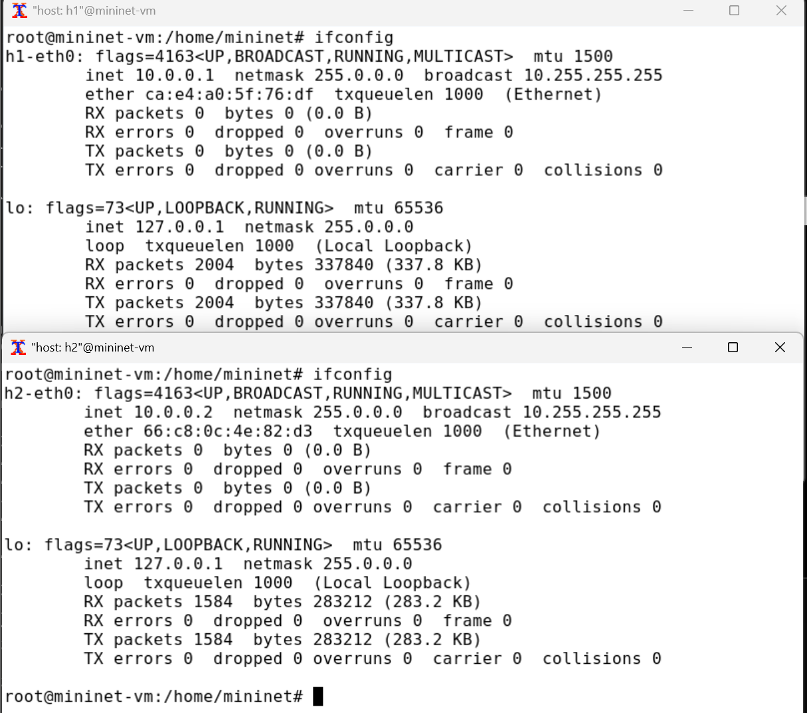

---
## Front matter
title: "Отчёт по лабораторной работе №4"
subtitle: "Дисциплина: Моделирование сетей передачи данных"
author: "Боровиков Даниил Александрович НПИбд-01-22"

## Generic otions
lang: ru-RU
toc-title: "Содержание"

## Bibliography
bibliography: bib/cite.bib
csl: pandoc/csl/gost-r-7-0-5-2008-numeric.csl

## Pdf output format
toc: true # Table of contents
toc-depth: 2
lof: true # List of figures
lot: true # List of tables
fontsize: 12pt
linestretch: 1.5
papersize: a4
documentclass: scrreprt
## I18n polyglossia
polyglossia-lang:
  name: russian
polyglossia-otherlangs:
  name: english
## I18n babel
babel-lang: russian
babel-otherlangs: english
## Fonts
mainfont: Arial
romanfont: Arial
sansfont: Arial
monofont: Arial
mainfontoptions: Ligatures=TeX
romanfontoptions: Ligatures=TeX
sansfontoptions: Ligatures=TeX,Scale=MatchLowercase
monofontoptions: Scale=MatchLowercase,Scale=0.9
## Biblatex
biblatex: true
biblio-style: "gost-numeric"
biblatexoptions:
  - parentracker=true
  - backend=biber
  - hyperref=auto
  - language=auto
  - autolang=other*
  - citestyle=gost-numeric
## Pandoc-crossref LaTeX customization
figureTitle: "Рис."
tableTitle: "Таблица"
listingTitle: "Листинг"
lofTitle: "Список иллюстраций"
lotTitle: "Список таблиц"
lolTitle: "Листинги"
## Misc options
indent: true
header-includes:
  - \usepackage{indentfirst}
  - \usepackage{float} # keep figures where there are in the text
  - \floatplacement{figure}{H} # keep figures where there are in the text
---

# Цель работы

Основной целью работы является знакомство с NETEM  [@wiki:bash]. — инструментом для
тестирования производительности приложений в виртуальной сети, а также
получение навыков проведения интерактивного и воспроизводимого экспериментов по измерению задержки и её дрожания (jitter) в моделируемой сети
в среде Mininet.

#  Задание

1. Задайте простейшую топологию, состоящую из двух хостов и коммутатора
с назначенной по умолчанию mininet сетью 10.0.0.0/8.

2. Проведите интерактивные эксперименты по добавлению/изменению задержки, джиттера, значения корреляции для джиттера и задержки, распределения
времени задержки в эмулируемой глобальной сети.

3. Реализуйте воспроизводимый эксперимент по заданию значения задержки
в эмулируемой глобальной сети. Постройте график.

4. Самостоятельно реализуйте воспроизводимые эксперименты по изменению
задержки, джиттера, значения корреляции для джиттера и задержки, распределения времени задержки в эмулируемой глобальной сети. Постройте
графики.

# Выполнение лабораторной работы

В виртуальной машине mininet исправим права запуска X-соединения (рис. [-@fig:001]):

{ #fig:001 width=100% height=100% }

Зададим простейшую топологию, состоящую из двух хостов и коммутатора с назначенной по 
умолчанию mininet сетью 10.0.0.0/8 (рис. [-@fig:002]):

{ #fig:002 width=100% height=100% }

На хостах h1 и h2 введём команду ifconfig, чтобы отобразить информацию, относящуюся к их сетевым 
интерфейсам и назначенным им IP-адресам. В дальнейшем при работе с NETEM и командой tc 
будут использоваться интерфейсы h1-eth0 и h2-eth0 (рис. [-@fig:003]):

{ #fig:003 width=100% height=100% }

Проверим подключение между хостами h1 и h2 с помощью команды ping с параметром -c 6 (рис. [-@fig:004]):

{ #fig:004 width=100% height=100% }

На хосте h1 добавим задержку в 100 мс к выходному интерфейсу (рис. [-@fig:005]):

{ #fig:005 width=100% height=100% }

Проверим, что соединение от хоста h1 к хосту h2 имеет задержку 100 мс, используя команду ping 
с параметром -c 6 с хоста h1 (рис. [-@fig:006]):

{ #fig:006 width=100% height=100% }

Для эмуляции глобальной сети с двунаправленной задержкой необходимо к соответствующему 
интерфейсу на хосте h2 также добавить задержку в 100 миллисекунд (рис. [-@fig:007]):

{ #fig:007 width=100% height=100% }

Проверим, что соединение между хостом h1 и хостом h2 имеет RTT в 200 мс (100 мс от хоста h1 к хосту h2 и 100 мс от хоста h2 к хосту h1), повторив
команду ping с параметром -c 6 на терминале хоста h1 (рис. [-@fig:008]):

{ #fig:008 width=100% height=100% }

Изменим задержку со 100 мс до 50 мс для отправителя h1 и для получателя h2 (рис. [-@fig:009]):

{ #fig:009 width=100% height=100% }

Проверим, что соединение от хоста h1 к хосту h2 имеет задержку 100 мс, используя команду ping с 
параметром -c 6 с терминала хоста h1 (рис. [-@fig:010]):

{ #fig:010 width=100% height=100% }

Восстановим конфигурацию по умолчанию, удалив все правила, применённые к сетевому планировщику 
соответствующего интерфейса (рис. [-@fig:011]):

{ #fig:011 width=100% height=100% }

Добавим на узле h1 задержку в 100 мс со случайным отклонением 10 мс (рис. [-@fig:012]):

{ #fig:012 width=100% height=100% }

Проверим, что соединение от хоста h1 к хосту h2 имеет задержку 100 мс со случайным отклонением 
±10 мс, используя в терминале хоста h1 команду ping с параметром -c 6 (рис. [-@fig:013]):

{ #fig:013 width=100% height=100% }

Восстановим конфигурацию интерфейса по умолчанию на узле h1 (рис. [-@fig:014]):

{ #fig:014 width=100% height=100% }

Добавим на интерфейсе хоста h1 задержку в 100 мс с вариацией ±10 мс и значением корреляции в 25%. 
Убедимся, что все пакеты, покидающие устройство h1 на интерфейсе h1- eth0, будут иметь 
время задержки 100 мс со случайным отклонением ±10 мс, при этом время передачи следующего 
пакета зависит от предыдущего значения на 25%. Используем для этого в терминале хоста h1 команду ping
с параметром -c 20 (рис. [-@fig:015]):

{ #fig:015 width=100% height=100% }

Восстановим конфигурацию интерфейса по умолчанию на узле h1 (рис. [-@fig:016]):

{ #fig:016 width=100% height=100% }

Зададим нормальное распределение задержки на узле h1 в эмулируемой сети (рис. [-@fig:017]):

{ #fig:017 width=100% height=100% }

Убедимся, что все пакеты, покидающие хост h1 на интерфейсе h1-eth0, будут иметь время задержки, 
которое распределено в диапазоне 100 мс ±20 мс. Используем для этого команду ping на терминале хоста h1 с параметром 
-c 10 (рис. [-@fig:018]):

{ #fig:018 width=100% height=100% }

Восстановим конфигурацию интерфейса по умолчанию на узле h1 (рис. [-@fig:019]):

{ #fig:019 width=100% height=100% }

Завершим работу mininet в интерактивном режиме (рис. [-@fig:020]):

{ #fig:020 width=100% height=100% }

Обновим репозитории программного обеспечения на виртуальной машине (рис. [-@fig:021]):

{ #fig:021 width=100% height=100% }

Установим пакет geeqie для просмотра файлов png (рис. [-@fig:022]):

{ #fig:022 width=100% height=100% }

Для каждого воспроизводимого эксперимента expname создадим свой каталог, в котором будут размещаться файлы эксперимента (рис. [-@fig:023]):

{ #fig:023 width=100% height=100% }

В виртуальной среде mininet в своём рабочем каталоге с проектами создадим каталог simple-delay и перейдём в него (рис. [-@fig:024]):

{ #fig:024 width=100% height=100% }

Создадим скрипт для эксперимента lab_netem_i.py (рис. [-@fig:025]):

{ #fig:025 width=100% height=100% }

Создадим файл ping_plot (рис. [-@fig:026]):

{ #fig:026 width=100% height=100% }

Затем создадим скрипт для визуализации ping_plot результатов эксперимента (рис. [-@fig:027]):

{ #fig:027 width=100% height=100% }

Зададим права доступа к файлу скрипта (рис. [-@fig:028]):

{ #fig:028 width=100% height=100% }

Создадим файла Makefile (рис. [-@fig:029]):

{ #fig:029 width=100% height=100% }

Внутри файла Makefile поместим скрипт для управления процессом проведения эксперимента (рис. [-@fig:030]):

{ #fig:030 width=100% height=100% }

Выполним эксперимент (рис. [-@fig:031]):

{ #fig:031 width=100% height=100% }

Просмотрим построенный в результате выполнения скриптов график (рис. [-@fig:032]):

{ #fig:032 width=100% height=100% }

Из файла ping.dat удалим первую строку и заново построим график (рис. [-@fig:033] - рис. [-@fig:034] ):

{ #fig:033 width=100% height=100% }

{ #fig:034 width=100% height=100% }

Просмотрим заново построенный график (рис. [-@fig:035]):

{ #fig:035 width=100% height=100% }

Разработаем скрипт для вычисления на основе данных файла ping.dat минимального, среднего, 
максимального и стандартного отклонения времени приёма-передачи. 
Также добавим правило запуска скрипта в Makefile (рис. [-@fig:036] - рис. [-@fig:038]):

{ #fig:036 width=100% height=100% }

{ #fig:037 width=100% height=100% }

{ #fig:038 width=100% height=100% }

Очистим каталог от результатов проведения экспериментов.

Самостоятельно реализуем воспроизводимые эксперименты по изменению задержки, джиттера, 
значения корреляции для джиттера и задержки, распределения времени задержки в эмулируемой 
глобальной сети. Построим графики. Вычислим минимальное, среднее, максимальное и стандартное отклонение
времени приёма-передачи для каждого случая (рис. [-@fig:039] - рис. [-@fig:050]):

{ #fig:039 width=100% height=100% }

{ #fig:040 width=100% height=100% }

{ #fig:041 width=100% height=100% }

{ #fig:042 width=100% height=100% }

{ #fig:043 width=100% height=100% }

{ #fig:044 width=100% height=100% }

{ #fig:045 width=100% height=100% }

{ #fig:046 width=100% height=100% }

{ #fig:047 width=100% height=100% }

{ #fig:048 width=100% height=100% }

{ #fig:049 width=100% height=100% }

{ #fig:050 width=100% height=100% }

# Выводы

В ходе выполнения лабораторной работы мы познакомились с NETEM — инструментом для
тестирования производительности приложений в виртуальной сети, а также
получение навыков проведения интерактивного и воспроизводимого экспериментов по измерению задержки и её дрожания (jitter) в моделируемой сети
в среде Mininet.

# Список литературы{.unnumbered}

::: {#refs}
:::

