---
## Front matter
lang: ru-RU
title: Лабораторная Работа №5. 
subtitle: Моделирование сетей передачи данных
author:
  - Боровиков Д.А.
institute:
  - Российский университет дружбы народов им. Патриса Лумумбы, Москва, Россия

## i18n babel
babel-lang: russian
babel-otherlangs: english

## Formatting pdf
toc: false
toc-title: Содержание
slide_level: 2
aspectratio: 169
section-titles: true
theme: metropolis
header-includes:
 - \metroset{progressbar=frametitle,sectionpage=progressbar,numbering=fraction}
 - '\makeatletter'
 - '\beamer@ignorenonframefalse'
 - '\makeatother'

## Fonts
mainfont: Arial
romanfont: Arial
sansfont: Arial
monofont: Arial
---

## Докладчик

  * Боровиков Даниил Александрович
  * НПИбд-01-22
  * Российский университет дружбы народов
  * [1132222006@pfur.ru]

## Цели и задачи

Основной целью работы является получение навыков проведения интерактивных экспериментов в среде Mininet по исследованию параметров сети,
связанных с потерей, дублированием, изменением порядка и повреждением
пакетов при передаче данных. Эти параметры влияют на производительность
протоколов и сетей.

## Исправление прав запуска

{#fig:001 width=70%}

## Создание простейшей топологии

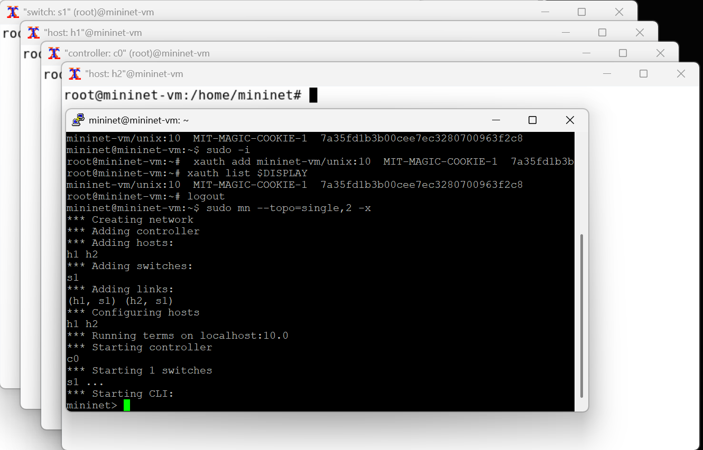{#fig:002 width=60%}

## Отображение информации их сетевых интерфейсов и IP-адресов

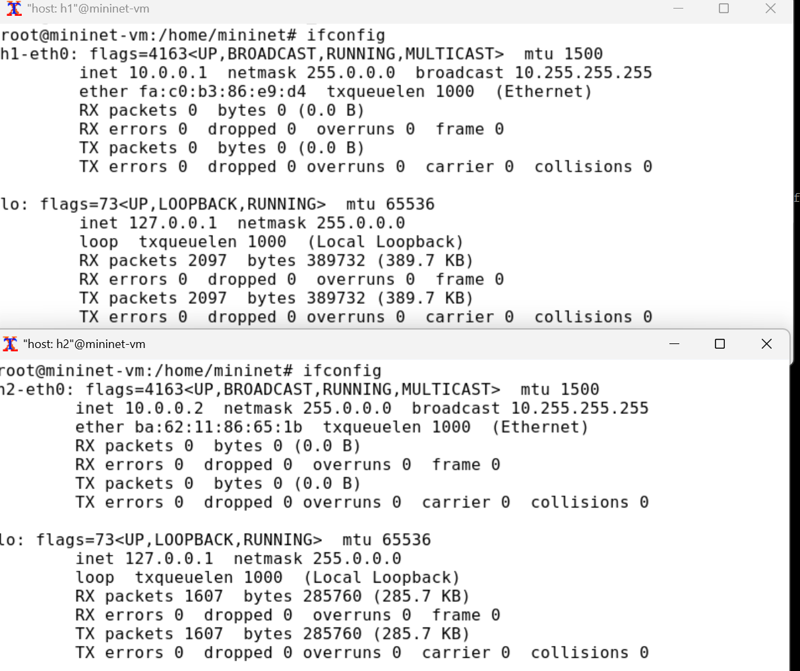{#fig:003 width=50%}

## Проверка подключения между хостами h1 и h2

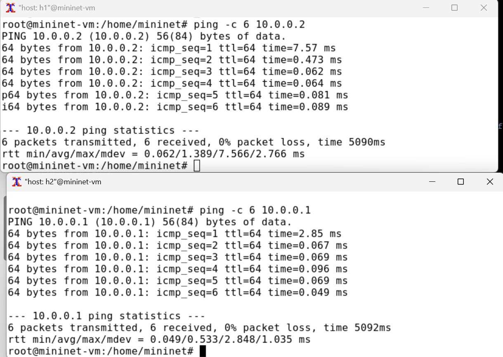{#fig:004 width=60%}

## Добавление 10% потерь пакетов на хосте h1

{#fig:005 width=70%}

## Проверка

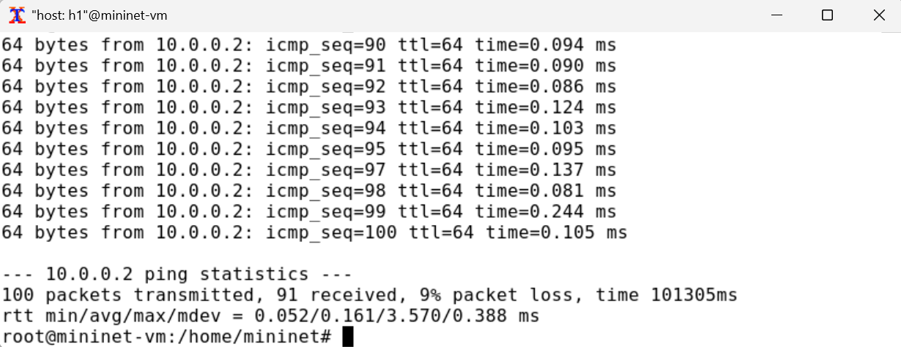{#fig:006 width=60%}

## Добавление 10% потерь пакетов на хосте h2

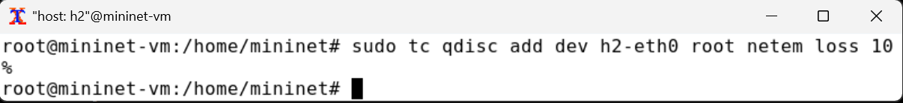{#fig:007 width=70%}

## Проверка

{#fig:008 width=60%}

## Восстановление конфигурации 

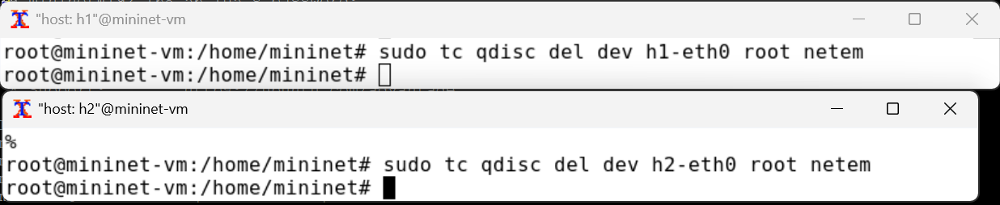{#fig:009 width=70%}

## Проверка

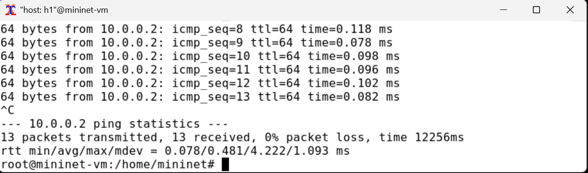{#fig:010 width=60%}

## Добавление коэффициента потери пакетов 50%

{#fig:011 width=70%}

## Проверка

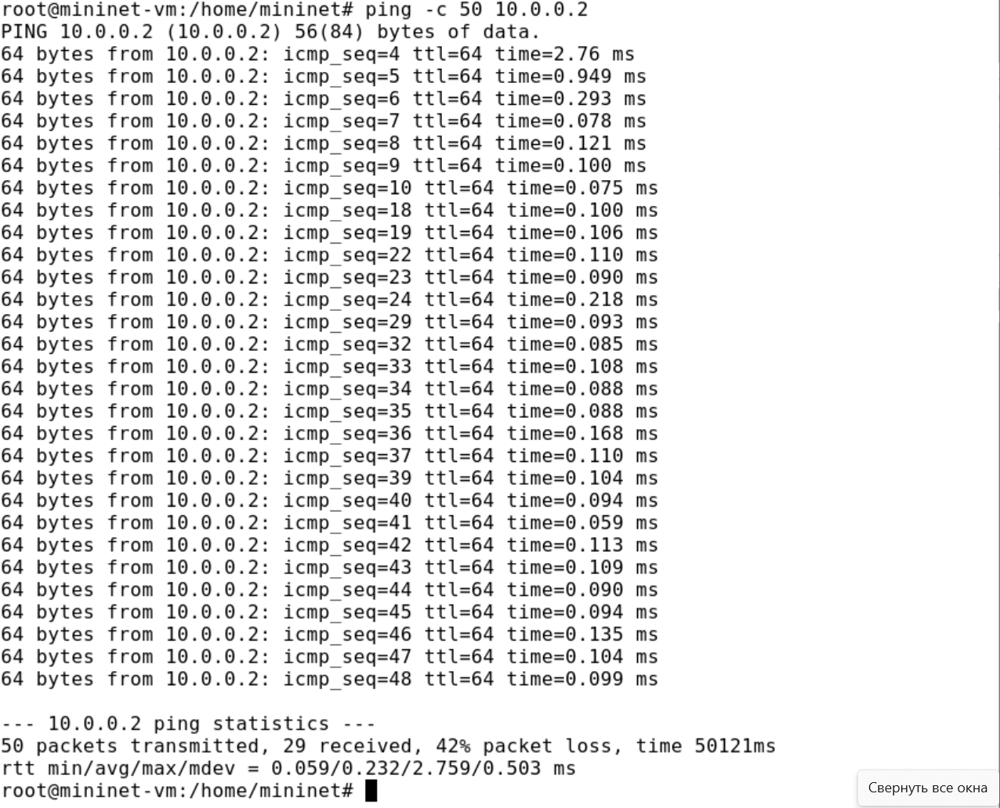{#fig:012 width=60%}

## Восстановление конфигурации 

{#fig:013 width=70%}

## Добавление повреждения пакетов

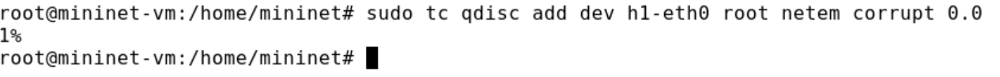{#fig:014 width=60%}

## Проверка конфигурации 

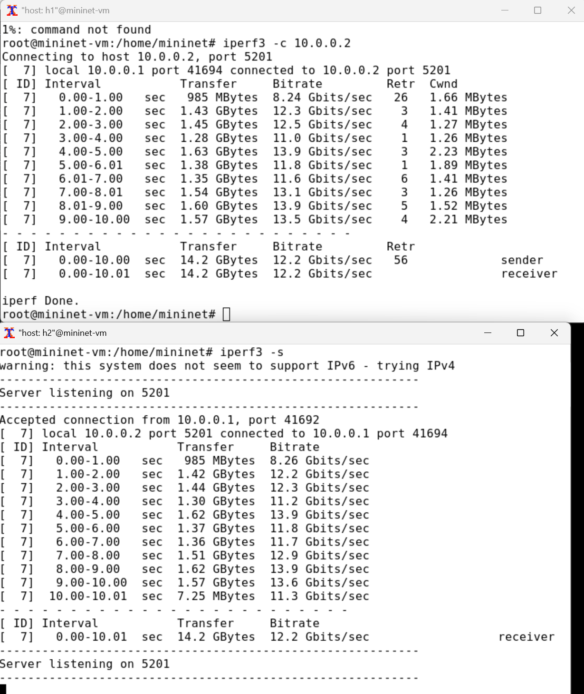{#fig:015 width=50%}

## Восстановление конфигурации 

{#fig:016 width=60%}

## Добавление правила 

{#fig:017 width=70%}

## Проверка

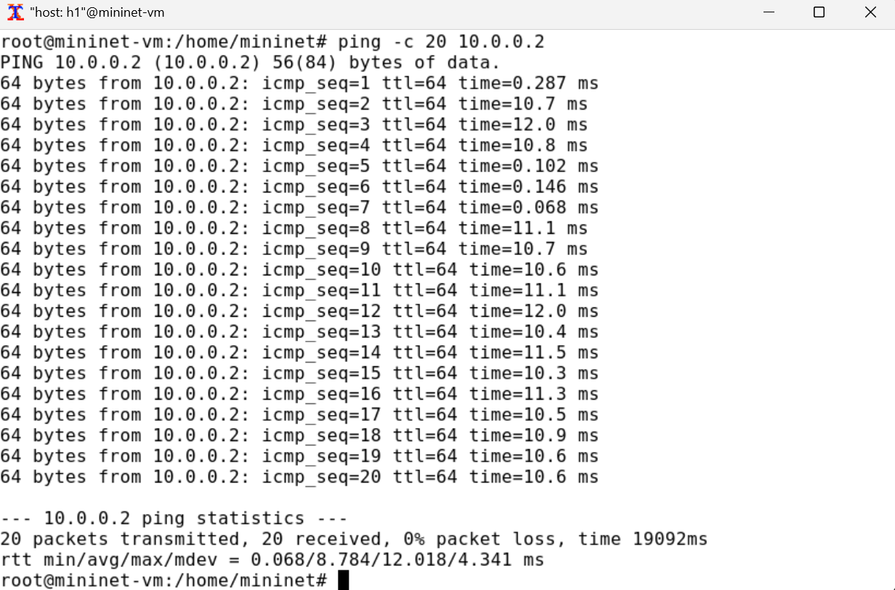{#fig:018 width=60%}

## Восстановление конфигурации

{#fig:019 width=70%}

## Добавление правила с дублированием 

{#fig:020 width=60%}

## Проверка

{#fig:021 width=50%}

## Восстановление конфигурации

{#fig:022 width=60%}

## Создание каталога expname

{#fig:023 width=70%}

## Создание каталога simple-drop 

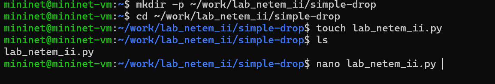{#fig:024 width=60%}

## Создание скрипта для эксперимента

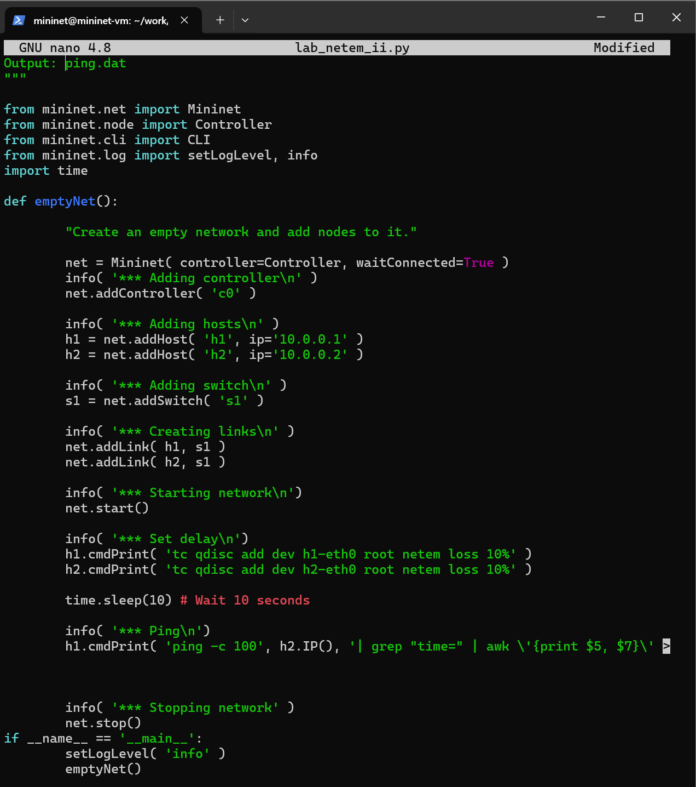{#fig:025 width=50%}

## Создание скрипта 

{#fig:026 width=60%}

## Создание Makefile

{#fig:027 width=70%}

## Выполнение эксперимента 

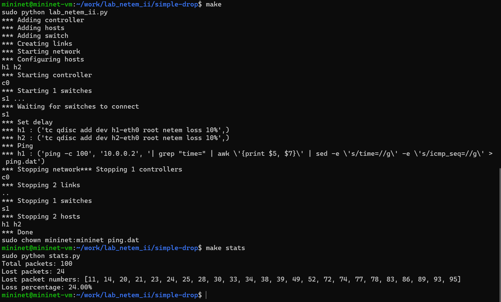{#fig:028 width=60%}

## Реализация воспроизводимого эксперимента 

{#fig:029 width=70%}

## Реализация воспроизводимого эксперимента 

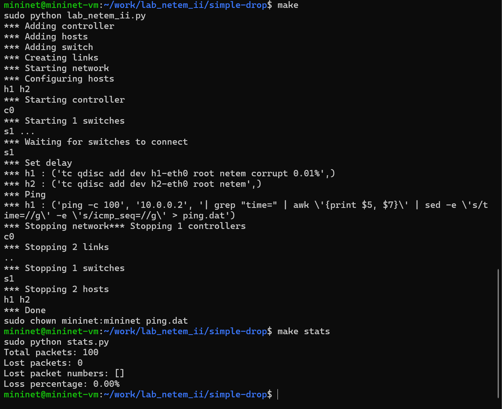{#fig:030 width=50%}

## Реализация воспроизводимого эксперимента 

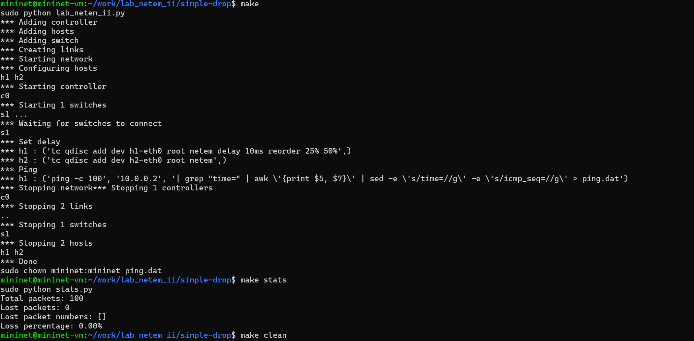{#fig:031 width=70%}

## Реализация воспроизводимого эксперимента 

{#fig:032 width=60%}

## Вывод

В ходе выполнения лабораторной работы мы получили навыки проведения интерактивных экспериментов в среде Mininet по исследованию параметров сети,
связанных с потерей, дублированием, изменением порядка и повреждением
пакетов при передаче данных. Эти параметры влияют на производительность
протоколов и сетей.

