---
## Front matter
title: "Отчёт по лабораторной работе №5"
subtitle: "Дисциплина: Моделирование сетей передачи данных"
author: "Боровиков Даниил Александрович НПИбд-01-22"

## Generic otions
lang: ru-RU
toc-title: "Содержание"

## Bibliography
bibliography: bib/cite.bib
csl: pandoc/csl/gost-r-7-0-5-2008-numeric.csl

## Pdf output format
toc: true # Table of contents
toc-depth: 2
lof: true # List of figures
lot: true # List of tables
fontsize: 12pt
linestretch: 1.5
papersize: a4
documentclass: scrreprt
## I18n polyglossia
polyglossia-lang:
  name: russian
polyglossia-otherlangs:
  name: english
## I18n babel
babel-lang: russian
babel-otherlangs: english
## Fonts
mainfont: Arial
romanfont: Arial
sansfont: Arial
monofont: Arial
mainfontoptions: Ligatures=TeX
romanfontoptions: Ligatures=TeX
sansfontoptions: Ligatures=TeX,Scale=MatchLowercase
monofontoptions: Scale=MatchLowercase,Scale=0.9
## Biblatex
biblatex: true
biblio-style: "gost-numeric"
biblatexoptions:
  - parentracker=true
  - backend=biber
  - hyperref=auto
  - language=auto
  - autolang=other*
  - citestyle=gost-numeric
## Pandoc-crossref LaTeX customization
figureTitle: "Рис."
tableTitle: "Таблица"
listingTitle: "Листинг"
lofTitle: "Список иллюстраций"
lotTitle: "Список таблиц"
lolTitle: "Листинги"
## Misc options
indent: true
header-includes:
  - \usepackage{indentfirst}
  - \usepackage{float} # keep figures where there are in the text
  - \floatplacement{figure}{H} # keep figures where there are in the text
---

# Цель работы

Основной целью работы является получение навыков проведения интерактивных экспериментов в среде Mininet по исследованию параметров сети,
связанных с потерей, дублированием, изменением порядка и повреждением
пакетов при передаче данных. Эти параметры влияют на производительность
протоколов и сетей.

#  Задание

1. Задайте простейшую топологию, состоящую из двух хостов и коммутатора
с назначенной по умолчанию mininet сетью 10.0.0.0/8.
2. Проведите интерактивные эксперименты по по исследованию параметров
сети, связанных с потерей, дублированием, изменением порядка и повреждением пакетов при передаче данных.
3. Реализуйте воспроизводимый эксперимент по добавлению правила отбрасывания пакетов в эмулируемой глобальной сети. На экран выведите сводную
информацию о потерянных пакетах.
4. Самостоятельно реализуйте воспроизводимые эксперименты по исследованию параметров сети, связанных с потерей, изменением порядка и повреждением пакетов при передаче данных. На экран выведите сводную
информацию о потерянных пакетах.

# Выполнение лабораторной работы

В виртуальной машине mininet исправим права запуска X-соединения (рис. [-@fig:001]):

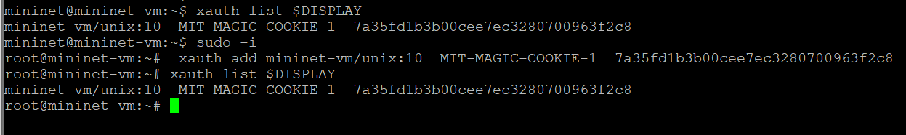{ #fig:001 width=100% height=100% }

Зададим простейшую топологию, состоящую из двух хостов и коммутатора с назначенной по 
умолчанию mininet сетью 10.0.0.0/8 (рис. [-@fig:002]):

{ #fig:002 width=100% height=100% }

На хостах h1 и h2 введём команду ifconfig, чтобы отобразить информацию, относящуюся к их сетевым 
интерфейсам и назначенным им IP-адресам. В дальнейшем при работе с NETEM [@wiki:bash] и командой tc 
будут использоваться интерфейсы h1-eth0 и h2-eth0 (рис. [-@fig:003]):

{ #fig:003 width=100% height=100% }

Проверим подключение между хостами h1 и h2 с помощью команды ping с параметром -c 6 (рис. [-@fig:004]):

{ #fig:004 width=100% height=100% }

На хосте h1 добавим 10% потерь пакетов к интерфейсу h1-eth0 (рис. [-@fig:005]):

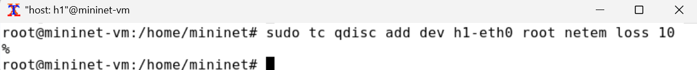{ #fig:005 width=100% height=100% }

Проверим, что на соединении от хоста h1 к хосту h2 имеются потери пакетов, используя команду ping с параметром -c 100 
с хоста h1 (рис. [-@fig:006]):

{ #fig:006 width=100% height=100% }

Для эмуляции глобальной сети с потерей пакетов в обоих направлениях необходимо 
к соответствующему интерфейсу на хосте h2 также добавить 10% потерь пакетов (рис. [-@fig:007]):

{ #fig:007 width=100% height=100% }

Проверим, что соединение между хостом h1 и хостом h2 имеет больший процент потерянных данных 
(10% от хоста h1 к хосту h2 и 10% от хоста h2 к хосту h1), повторив команду ping 
с параметром -c 100 на терминале хоста h1 (рис. [-@fig:008]):

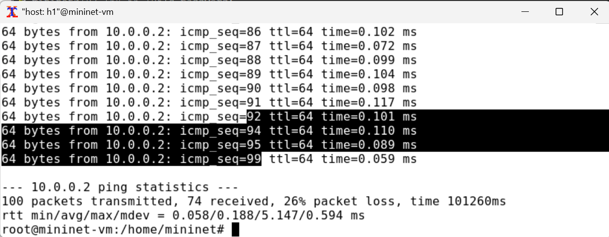{ #fig:008 width=100% height=100% }

Пропущенные номера icmp_seq (от 1 до 100): 3, 8, 9, 14, 20, 25, 27, 29, 33, 37, 38, 42, 48, 53, 58, 64, 66, 68, 74, 81, 82, 93, 96, 97, 98 100

Восстановим конфигурацию по умолчанию, удалив все правила, применённые к сетевому планировщику 
соответствующего интерфейса (рис. [-@fig:009]):

{ #fig:009 width=100% height=100% }

Убедимся, что соединение от хоста h1 к хосту h2 не имеет явной потери пакетов, 
запустив команду ping с терминала хоста h1 и затем нажав Ctrl + c , чтобы остановить тест (рис. [-@fig:010]):

{ #fig:010 width=100% height=100% }

Добавим на интерфейсе узла h1 коэффициент потери пакетов 50% (такой высокий уровень потери 
пакетов маловероятен), и каждая последующая вероятность зависит на 50% от последней (рис. [-@fig:011]):

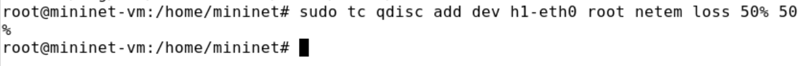{ #fig:011 width=100% height=100% }

Проверим, что на соединении от хоста h1 к хосту h2 имеются потери пакетов, используя команду 
ping с параметром -c 50 с хоста h1 (рис. [-@fig:012]):

{ #fig:012 width=100% height=100% }

Восстановим конфигурацию интерфейса по умолчанию на узле h1 (рис. [-@fig:013]):

{ #fig:013 width=100% height=100% }

Добавим на интерфейсе узла h1 0,01% повреждения пакетов (рис. [-@fig:014]):

{ #fig:014 width=100% height=100% }

Проверим конфигурацию с помощью инструмента iPerf3 для проверки
повторных передач. Для этого запустим iPerf3 в режиме сервера в терминале хоста h2,
запустим iPerf3 в клиентском режиме в терминале хоста h1 (рис. [-@fig:015]):

{ #fig:015 width=100% height=100% }

Восстановим для узла h1 конфигурацию по умолчанию (рис. [-@fig:016]):

{ #fig:016 width=100% height=100% }

Добавим на интерфейсе узла h1 правило из лабораторной работы (рис. [-@fig:017]):

{ #fig:017 width=100% height=100% }

Проверим, что на соединении от хоста h1 к хосту h2 имеются потери пакетов, используя команду ping 
с параметром -c 20 с хоста h1. Убедимся, что часть пакетов не будут иметь задержки 
(один из четырех, или 25%), а последующие несколько пакетов будут иметь задержку около 10 миллисекунд (три
из четырех, или 75%) (рис. [-@fig:018]):

{ #fig:018 width=100% height=100% }

Восстановим конфигурацию интерфейса по умолчанию на узле h1 (рис. [-@fig:019]):

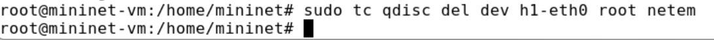{ #fig:019 width=100% height=100% }

Для интерфейса узла h1 зададим правило c дублированием 50% пакетов (т.е. 50% пакетов должны 
быть получены дважды) (рис. [-@fig:020]):

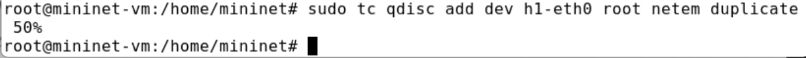{ #fig:020 width=100% height=100% }

Проверим, что на соединении от хоста h1 к хосту h2 имеются дублированные пакеты, используя 
команду ping с параметром -c 20 с хоста h1. Дубликаты пакетов помечаются как DUP!. 
Измеренная скорость дублирования пакетов будет приближаться к настроенной скорости по мере 
выполнения большего количества попыток (рис. [-@fig:021]):

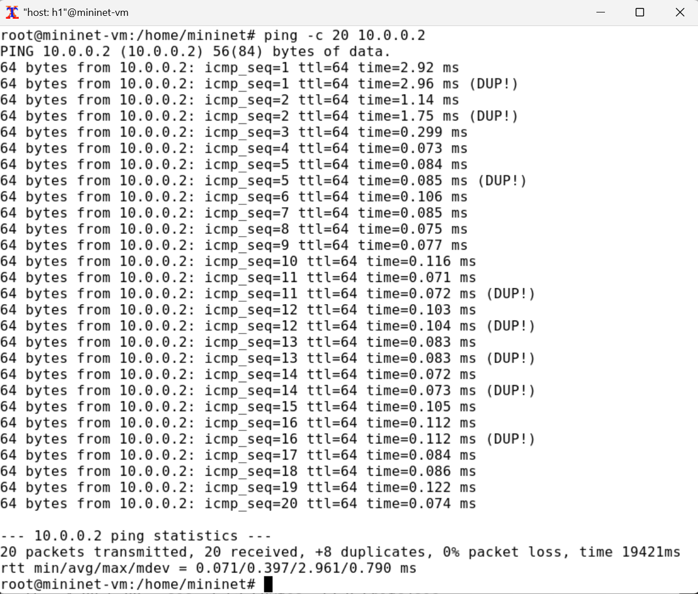{ #fig:021 width=100% height=100% }

Восстановим конфигурацию интерфейса по умолчанию на узле h1 (рис. [-@fig:022]):

{ #fig:022 width=100% height=100% }

Для каждого воспроизводимого эксперимента expname создадим свой каталог, 
в котором будут размещаться файлы эксперимента (рис. [-@fig:023]):

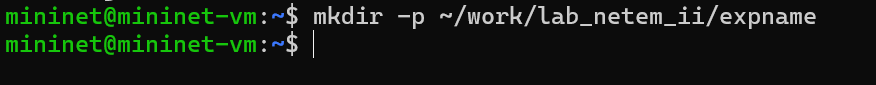{ #fig:023 width=100% height=100% }

В виртуальной среде mininet в своём рабочем каталоге с проектами создадим каталог simple-drop и перейдём в него (рис. [-@fig:024]):

{ #fig:024 width=100% height=100% }

Создадим скрипт для эксперимента lab_netem_ii.py (рис. [-@fig:025]):

{ #fig:025 width=100% height=100% }

Затем создадим скрипт, чтобы на экран или в отдельный файл выводилась информация о потерях пакетов (рис. [-@fig:026]):

{ #fig:026 width=100% height=100% }

Создадим Makefile для управления процессом проведения эксперимента (рис. [-@fig:027]):

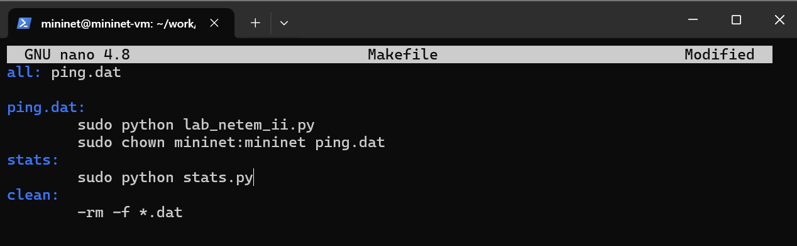{ #fig:027 width=100% height=100% }

Выполним эксперимент и далее очистим каталог от результатов проведения экспериментов (рис. [-@fig:028]):

{ #fig:028 width=100% height=100% }

Далее реализуем воспроизводимые эксперименты по исследованию параметров сети, связанных 
с потерей, изменением порядка и повреждением пакетов при передаче данных (рис. [-@fig:029] - рис. [-@fig:032]):

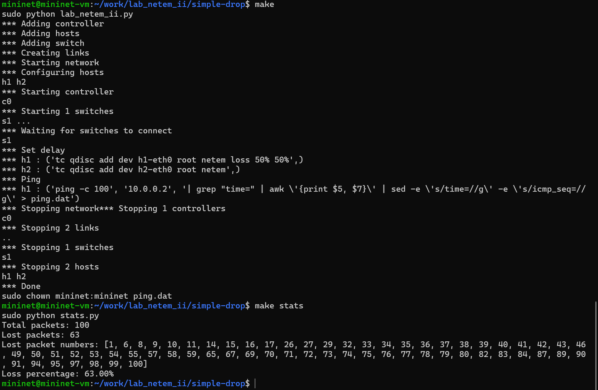{ #fig:029 width=100% height=100% }

{ #fig:030 width=100% height=100% }

{ #fig:031 width=100% height=100% }

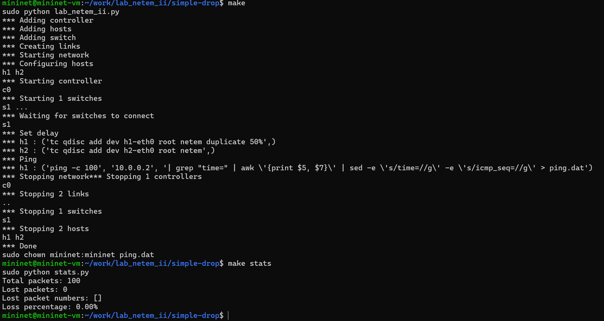{ #fig:032 width=100% height=100% }

# Выводы

В ходе выполнения лабораторной работы мы получили навыки проведения интерактивных экспериментов в среде Mininet по исследованию параметров сети,
связанных с потерей, дублированием, изменением порядка и повреждением
пакетов при передаче данных. Эти параметры влияют на производительность
протоколов и сетей.

# Список литературы{.unnumbered}

::: {#refs}
:::

