---
## Front matter
lang: ru-RU
title: Лабораторная Работа №6. 
subtitle: Моделирование сетей передачи данных
author:
  - Боровиков Д.А.
institute:
  - Российский университет дружбы народов им. Патриса Лумумбы, Москва, Россия

## i18n babel
babel-lang: russian
babel-otherlangs: english

## Formatting pdf
toc: false
toc-title: Содержание
slide_level: 2
aspectratio: 169
section-titles: true
theme: metropolis
header-includes:
 - \metroset{progressbar=frametitle,sectionpage=progressbar,numbering=fraction}
 - '\makeatletter'
 - '\beamer@ignorenonframefalse'
 - '\makeatother'

## Fonts
mainfont: Arial
romanfont: Arial
sansfont: Arial
monofont: Arial
---

## Докладчик

  * Боровиков Даниил Александрович
  * НПИбд-01-22
  * Российский университет дружбы народов
  * [1132222006@pfur.ru]

## Цели и задачи

Основной целью работы является знакомство с принципами работы дисциплины очереди Token Bucket Filter, которая формирует входящий/исходящий
трафик для ограничения пропускной способности, а также получение навыков
моделирования и исследования поведения трафика посредством проведения
интерактивного и воспроизводимого экспериментов в Mininet.

## Исправление прав запуска 

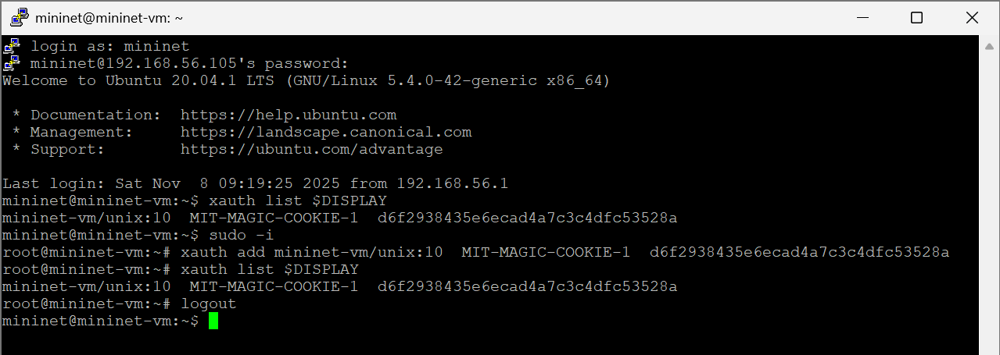{#fig:001 width=70%}

## Создание топологии 

{#fig:002 width=60%}

## Отображение информации  

{#fig:003 width=70%}

## Проверка подключения между хостами h1 и h2

{#fig:004 width=60%}

## Запуск iPerf3 в режиме сервера на хосте h2

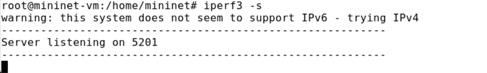{#fig:005 width=70%}

## Запуск iPerf3 в режиме клиента на хосте h1

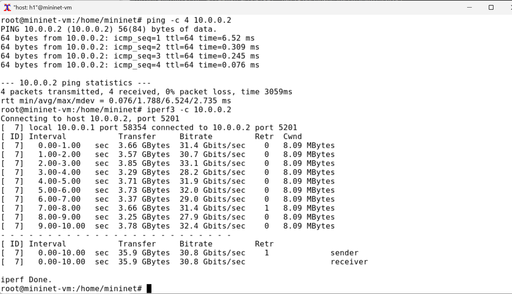{#fig:006 width=60%}

## Остановка iPerf3

{#fig:007 width=70%}

## Изменение пропускной способности хоста h1

{#fig:008 width=60%}

## Установка значения всплеска

{#fig:009 width=70%}

## Запуск iPerf3 

{#fig:010 width=60%}

## Запуск iPerf3

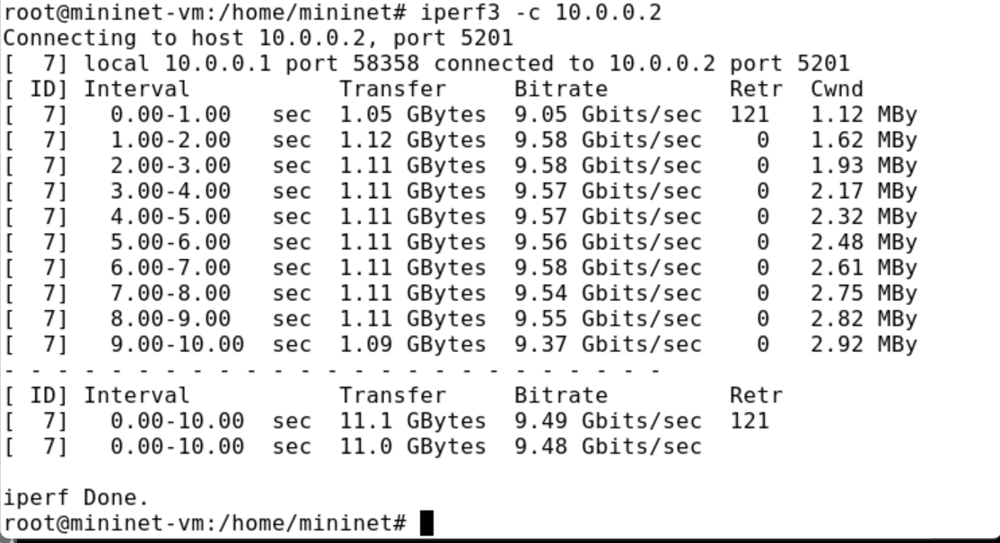{#fig:011 width=70%}

## Остановка iPerf3

{#fig:012 width=60%}

## Удаление конфигурации 

{#fig:013 width=70%}

## Применение правила

{#fig:014 width=60%}

## Запуск iPerf3 

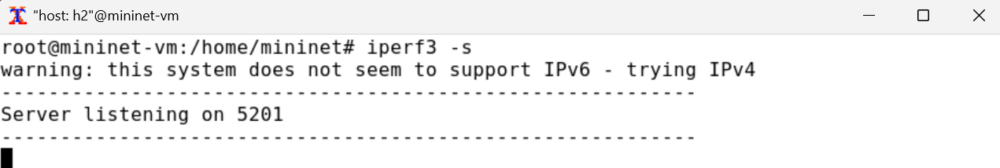{#fig:015 width=70%}

## Запуск iPerf3

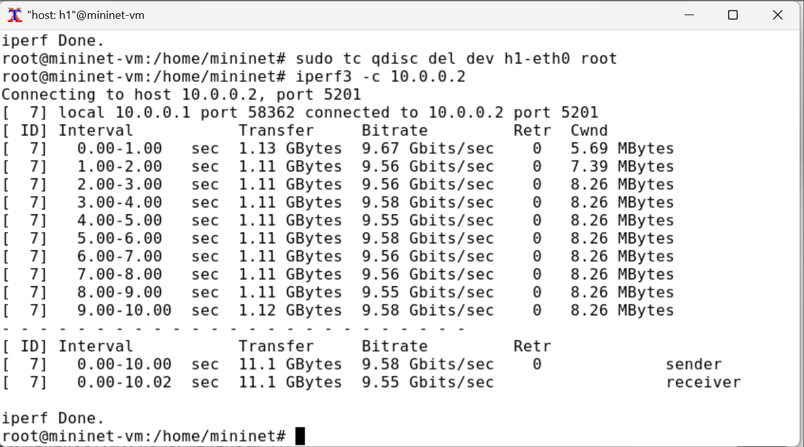{#fig:016 width=60%}

## Остановка iPerf3

{#fig:017 width=70%}

## Удаление  конфигурации 

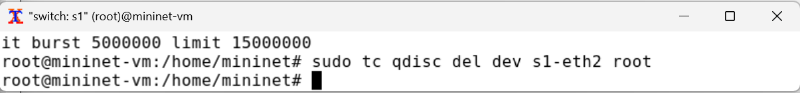{#fig:018 width=60%}

## Объединение NETEM и TBF

{#fig:019 width=70%}

## Проверка задержки

{#fig:020 width=60%}

## Добавление второго правила на коммутаторе s1

{#fig:021 width=70%}

## Запуск iPerf3

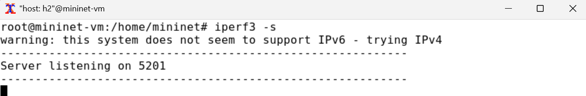{#fig:022 width=60%}

## Запуск iPerf3 

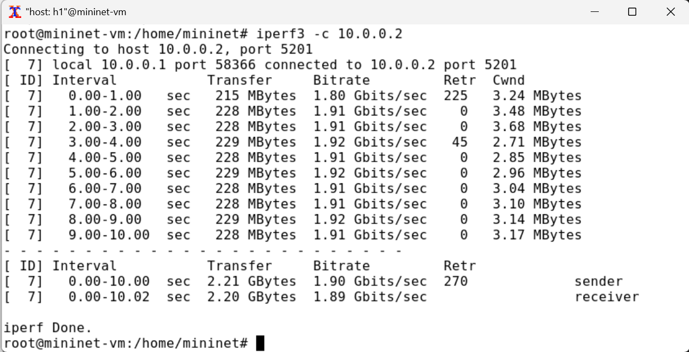{#fig:023 width=70%}

## Остановка iPerf3

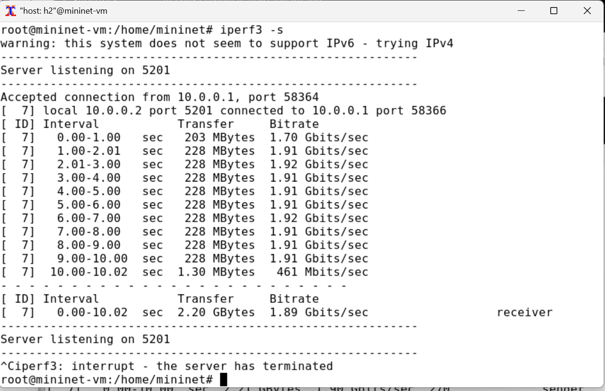{#fig:024 width=60%}

## Удаление конфигурации 

{#fig:025 width=70%}

## Создание необходимых каталогов

{#fig:026 width=60%}

## Написание 1 скрпита

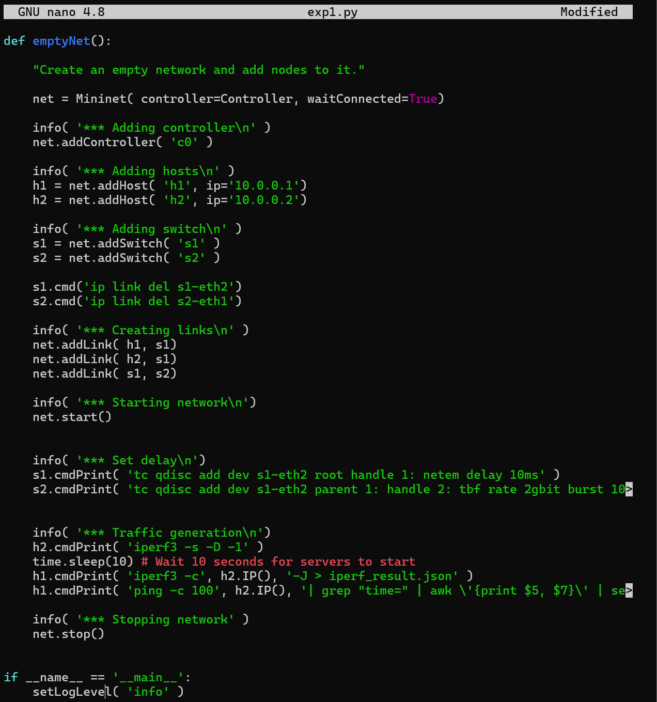{#fig:027 width=50%}

## Написание 2 скрпита

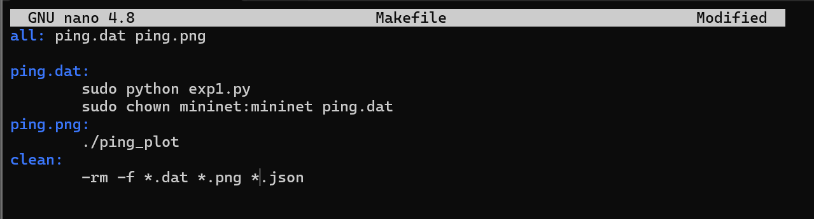{#fig:028 width=60%}

## Написание 3 скрпита

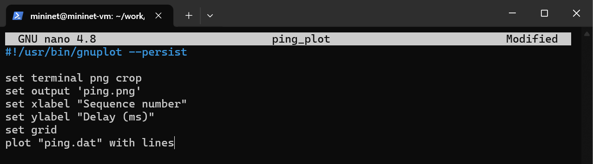{#fig:029 width=70%}

## Выполнение скриптов

{#fig:030 width=60%}

## Изменение параметров

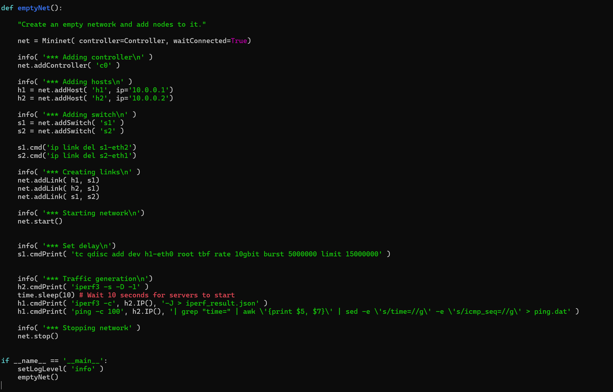{#fig:031 width=70%}

## Выполнение скриптов

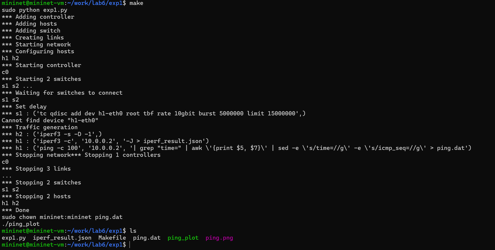{#fig:032 width=60%}

## График №1

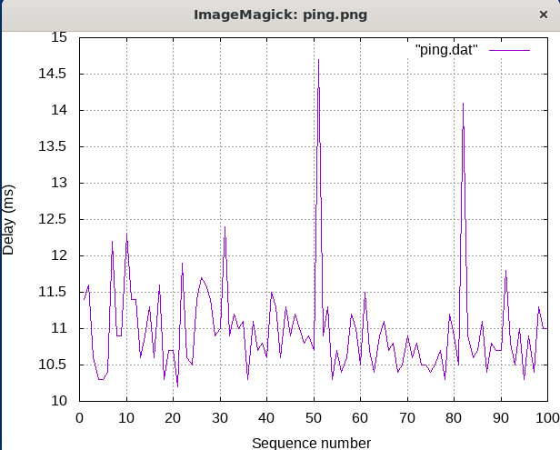{#fig:033 width=50%}

## График №2

{#fig:034 width=60%}

## Вывод

В ходе выполнения лабораторной работы мы познакомились с принципами работы дисциплины очереди Token Bucket Filter, которая формирует входящий/исходящий
трафик для ограничения пропускной способности, а также получение навыков
моделирования и исследования поведения трафика посредством проведения
интерактивного и воспроизводимого экспериментов в Mininet.

