---
## Front matter
title: "Отчёт по лабораторной работе №6"
subtitle: "Дисциплина: Моделирование сетей передачи данных"
author: "Боровиков Даниил Александрович НПИбд-01-22"

## Generic otions
lang: ru-RU
toc-title: "Содержание"

## Bibliography
bibliography: bib/cite.bib
csl: pandoc/csl/gost-r-7-0-5-2008-numeric.csl

## Pdf output format
toc: true # Table of contents
toc-depth: 2
lof: true # List of figures
lot: true # List of tables
fontsize: 12pt
linestretch: 1.5
papersize: a4
documentclass: scrreprt
## I18n polyglossia
polyglossia-lang:
  name: russian
polyglossia-otherlangs:
  name: english
## I18n babel
babel-lang: russian
babel-otherlangs: english
## Fonts
mainfont: Arial
romanfont: Arial
sansfont: Arial
monofont: Arial
mainfontoptions: Ligatures=TeX
romanfontoptions: Ligatures=TeX
sansfontoptions: Ligatures=TeX,Scale=MatchLowercase
monofontoptions: Scale=MatchLowercase,Scale=0.9
## Biblatex
biblatex: true
biblio-style: "gost-numeric"
biblatexoptions:
  - parentracker=true
  - backend=biber
  - hyperref=auto
  - language=auto
  - autolang=other*
  - citestyle=gost-numeric
## Pandoc-crossref LaTeX customization
figureTitle: "Рис."
tableTitle: "Таблица"
listingTitle: "Листинг"
lofTitle: "Список иллюстраций"
lotTitle: "Список таблиц"
lolTitle: "Листинги"
## Misc options
indent: true
header-includes:
  - \usepackage{indentfirst}
  - \usepackage{float} # keep figures where there are in the text
  - \floatplacement{figure}{H} # keep figures where there are in the text
---

[@wiki:bash]

# Цель работы

Основной целью работы является знакомство с принципами работы дисциплины очереди Token Bucket Filter, которая формирует входящий/исходящий
трафик для ограничения пропускной способности, а также получение навыков
моделирования и исследования поведения трафика посредством проведения
интерактивного и воспроизводимого экспериментов в Mininet.

#  Задание

1. Задайте топологию, состоящую из двух хостов и двух коммутаторов
с назначенной по умолчанию mininet сетью 10.0.0.0/8.
2. Проведите интерактивные эксперименты по ограничению пропускной способности сети с помощью TBF в эмулируемой глобальной сети.
3. Самостоятельно реализуйте воспроизводимые эксперимент по применению
TBF для ограничения пропускной способности. Постройте соответствующие
графики.

# Выполнение лабораторной работы

В виртуальной машине mininet исправим права запуска X-соединения (рис. [-@fig:001]):

{ #fig:001 width=100% height=100% }

Зададим топологию сети, состоящую из двух хостов и двух коммутаторов с назначенной по умолчанию 
mininet сетью 10.0.0.0/8 (рис. [-@fig:002]):

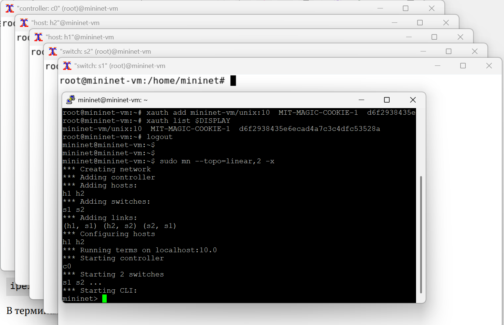{ #fig:002 width=100% height=100% }

На хостах h1, h2 и на коммутаторах s1, s2 введём команду ifconfig, чтобы отобразить информацию, 
относящуюся к их сетевым интерфейсам и назначенным им IP-адресам. В дальнейшем при работе с NETEM 
и командой tc будем использовать интерфейсы h1-eth0, h2-eth0, s1-eth2 (рис. [-@fig:003]):

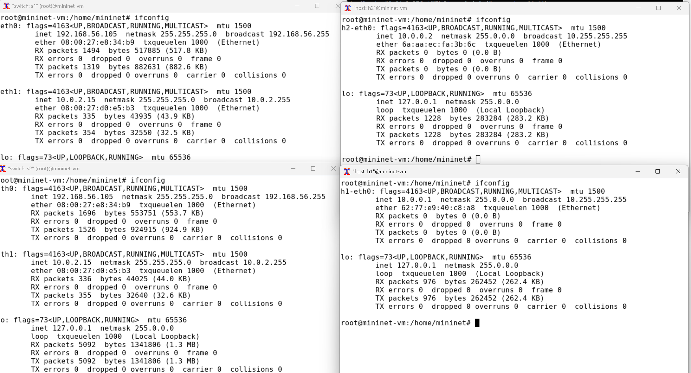{ #fig:003 width=100% height=100% }

Проверим подключение между хостами h1 и h2 с помощью команды ping с параметром -c 4 (рис. [-@fig:004]):

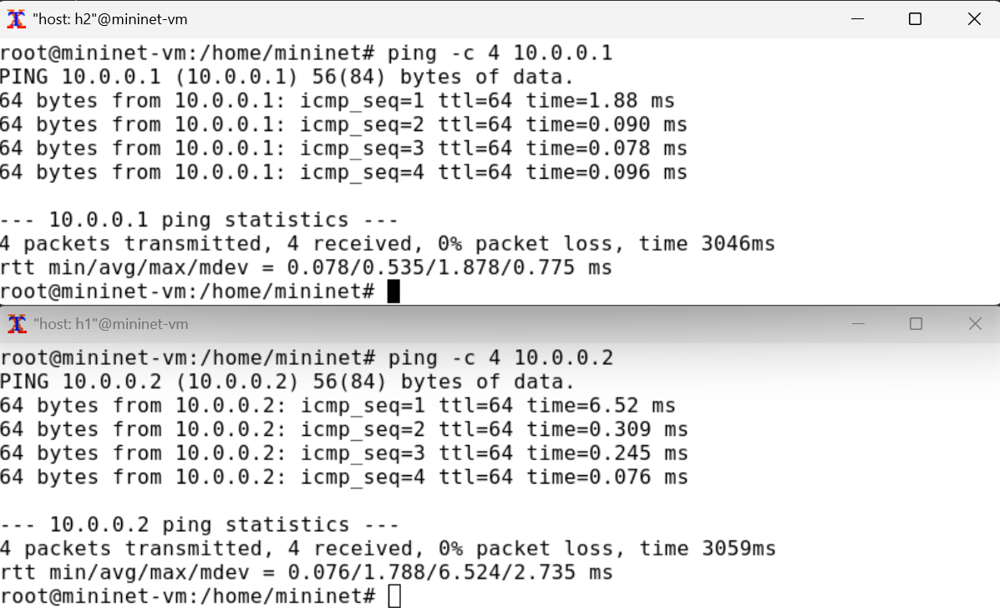{ #fig:004 width=100% height=100% }

В терминале хоста h2 запустим iPerf3 в режиме сервера (рис. [-@fig:005]):

{ #fig:005 width=100% height=100% }

В терминале хоста h1 запустим iPerf3 в режиме клиента (рис. [-@fig:006]):

{ #fig:006 width=100% height=100% }

После завершения работы iPerf3 на хосте h1 остановим iPerf3 на хосте h2, нажав Ctrl + c (рис. [-@fig:007]):

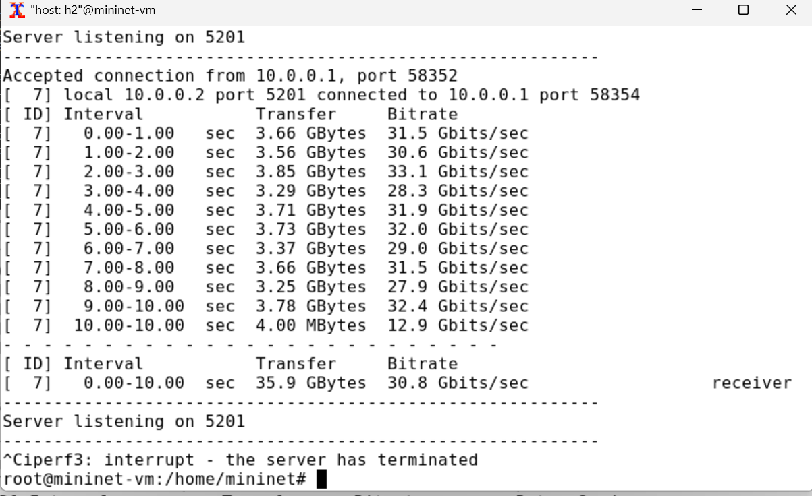{ #fig:007 width=100% height=100% }

Команду tc можно применить к сетевому интерфейсу устройства для формирования исходящего трафика. Требуется ограничить 
скорость отправки данных с конечного хоста с помощью фильтра Token Bucket Filter (tbf) [@wiki:bash].

Изменим пропускную способность хоста h1, установив пропускную способность на 10 Гбит/с на интерфейсе 
h1-eth0 и параметры TBF-фильтра (рис. [-@fig:008]):

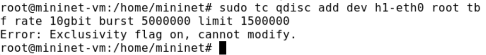{ #fig:008 width=100% height=100% }

Фильтр tbf требует установки значения всплеска при ограничении скорости. Это значение должно 
быть достаточно высоким, чтобы обеспечить установленную скорость. Она должна быть не ниже указанной частоты, 
делённой на HZ, где HZ — тактовая частота, настроенная как параметр ядра, и может быть извлечена с 
помощью следующей команды (рис. [-@fig:009]):

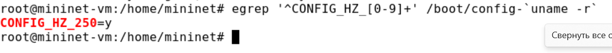{ #fig:009 width=100% height=100% }

С помощью iPerf3 проверим, что значение пропускной способности изменилось.

В терминале хоста h2 запустим iPerf3 в режиме сервера (рис. [-@fig:010]):

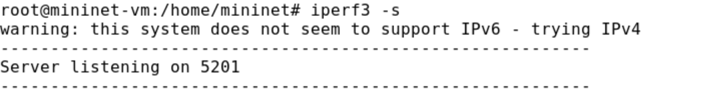{ #fig:010 width=100% height=100% }

В терминале хоста h1 запустим iPerf3 в режиме клиента (рис. [-@fig:011]):

{ #fig:011 width=100% height=100% }

После завершения работы iPerf3 на хосте h1 остановим iPerf3 на хосте h2, нажав Ctrl + c (рис. [-@fig:012]):

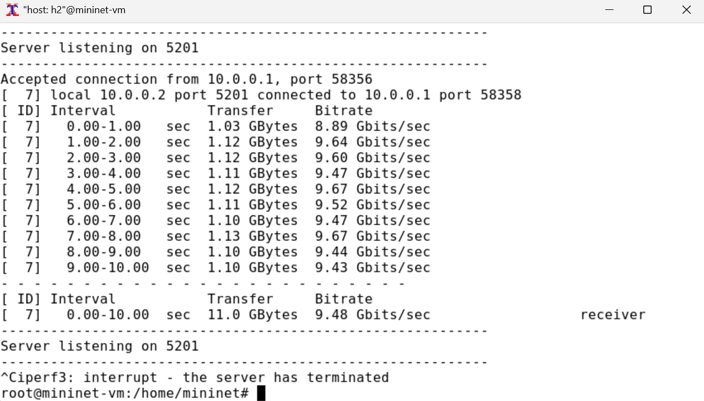{ #fig:012 width=100% height=100% }

Удалим модифицированную конфигурацию на хосте h1 (рис. [-@fig:013]):

{ #fig:013 width=100% height=100% }

Применим правило ограничения скорости tbf с параметрами rate = 10gbit, burst = 5,000,000, 
limit= 15,000,000 к интерфейсу s1-eth2 коммутатора s1, который соединяет его с коммутатором s2 (рис. [-@fig:014]):

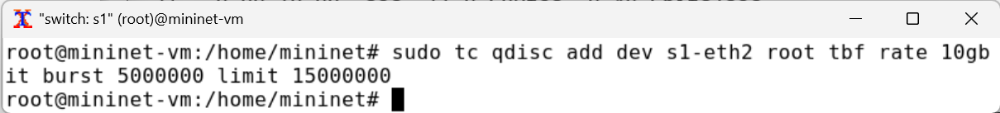{ #fig:014 width=100% height=100% }

Проверим конфигурацию с помощью инструмента iperf3 для измерения пропускной способности.

В терминале хоста h2 запустим iPerf3 в режиме сервера (рис. [-@fig:015]):

{ #fig:015 width=100% height=100% }

В терминале хоста h1 запустим iPerf3 в режиме клиента (рис. [-@fig:016]):

{ #fig:016 width=100% height=100% }

После завершения работы iPerf3 на хосте h1 остановим iPerf3 на хосте h2, нажав Ctrl + c (рис. [-@fig:017]):

{ #fig:017 width=100% height=100% }

Удалим модифицированную конфигурацию на коммутаторе s1 (рис. [-@fig:018]):

{ #fig:018 width=100% height=100% }

NETEM используется для изменения задержки, джиттера, повреждения пакетов и т.д. TBF может использоваться для ограничения 
скорости. Утилита tc позволяет комбинировать несколько модулей. При этом первая дисциплина очереди (qdisc1) 
присоединяется к корневой метке, последующие дисциплины очереди можно прикрепить к своим родителям, указав правильную метку.

Объединим NETEM и TBF, введя на интерфейсе s1-eth2 коммутатора s1 задержку, джиттер, повреждение пакетов и указав скорость (рис. [-@fig:019]):

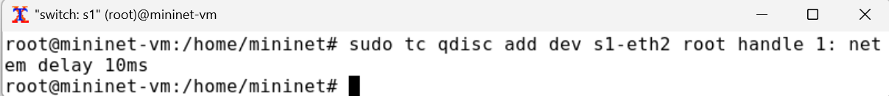{ #fig:019 width=100% height=100% }

Убедимся, что соединение от хоста h1 к хосту h2 имеет заданную задержку. Для этого запустим 
команду ping с параметром -c 4 с терминала хоста h1 (рис. [-@fig:020]):

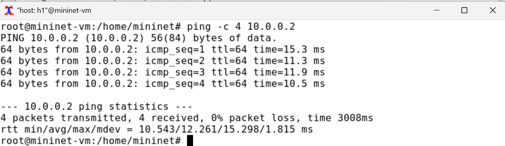{ #fig:020 width=100% height=100% }

Добавим второе правило на коммутаторе s1, которое задаёт ограничение скорости с помощью tbf с параметрами rate=2gbit, 
burst=1,000,000, limit=2,000,000 (рис. [-@fig:021]):

{ #fig:021 width=100% height=100% }

Проверим конфигурацию с помощью инструмента iperf3 для измерения пропускной способности.

В терминале хоста h2 запустим iPerf3 в режиме сервера (рис. [-@fig:022]):

{ #fig:022 width=100% height=100% }

В терминале хоста h1 запустим iPerf3 в режиме клиента (рис. [-@fig:023]):

{ #fig:023 width=100% height=100% }

После завершения работы iPerf3 на хосте h1 остановим iPerf3 на хосте h2, нажав Ctrl + c (рис. [-@fig:024]):

{ #fig:024 width=100% height=100% }

Удалим модифицированную конфигурацию на коммутаторе s1 (рис. [-@fig:025]):

{ #fig:025 width=100% height=100% }

Для самостоятельного задания создадим необходимые каталоги (рис. [-@fig:026]):

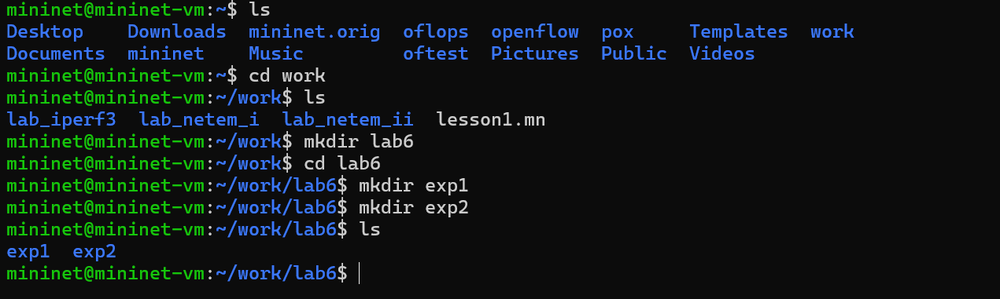{ #fig:026 width=100% height=100% }

Затем напишем скрипты по примеру из прошлых лабораторных работ (рис. [-@fig:027] - рис. [-@fig:029]):

{ #fig:027 width=100% height=100% }

{ #fig:028 width=100% height=100% }

{ #fig:029 width=100% height=100% }

Запустим на выполнение скрипты для первой части самостоятельного задания (рис. [-@fig:030]):

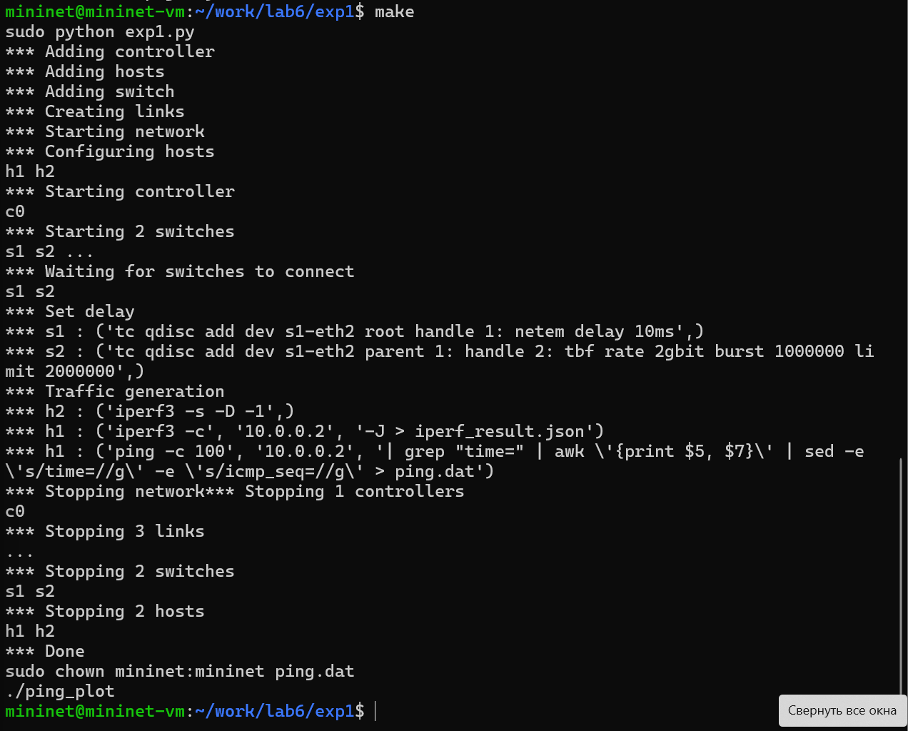{ #fig:030 width=100% height=100% }

Изменим параметры в скрипте для первого задания и запустим на выполнение (рис. [-@fig:031] - рис. [-@fig:032]):

{ #fig:031 width=100% height=100% }

{ #fig:032 width=100% height=100% }

Просмотрим полученные графики (рис. [-@fig:033] - рис. [-@fig:034]):

{ #fig:033 width=100% height=100% }

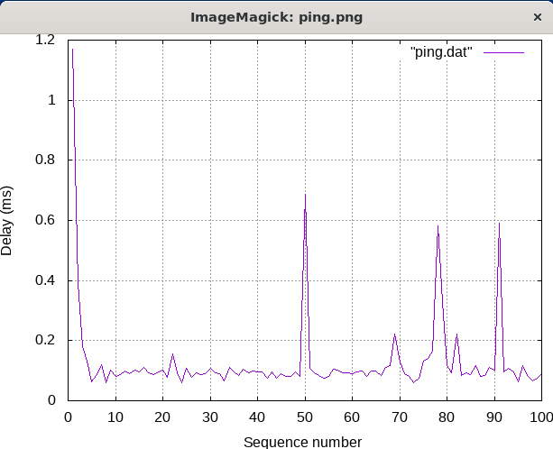{ #fig:034 width=100% height=100% }

# Выводы

В ходе выполнения лабораторной работы мы познакомились с принципами работы дисциплины очереди Token Bucket Filter, которая формирует входящий/исходящий
трафик для ограничения пропускной способности, а также получение навыков
моделирования и исследования поведения трафика посредством проведения
интерактивного и воспроизводимого экспериментов в Mininet.

# Список литературы{.unnumbered}

::: {#refs}
:::

